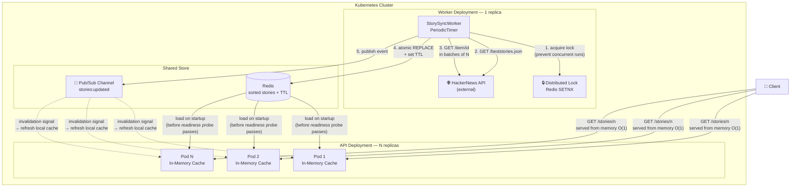

# HackerNews Gateway API

ASP.NET Core REST API that returns the best N stories from the [Hacker News API](https://github.com/HackerNews/API), sorted by score descending.

## How to Run

**Requirements:** .NET 10 SDK

```bash
cd HackerNewsGatewayApi
dotnet run
```

The API will be available at `https://localhost:7xxx` or `http://localhost:5xxx` (see console output).

## Endpoint

```
GET /stories/{n}
```

Returns the top `n` stories sorted by score descending. Maximum `n` is 100 (configurable).

**Example:**
```bash
curl https://localhost:7222/stories/5
```

**Response:**
```json
[
  {
    "title": "A uBlock Origin update was rejected from the Chrome Web Store",
    "uri": "https://github.com/uBlockOrigin/uBlock-issues/issues/745",
    "postedBy": "ismaildonmez",
    "time": "2019-10-12T13:43:01+00:00",
    "score": 1716,
    "commentCount": 572
  }
]
```

**Status codes:**
| Code | Reason |
|---|---|
| 200 | Success |
| 400 | `n` is zero, negative, or exceeds the configured maximum |
| 503 | Cache still warming up on cold start (retry after 10s) |

## Current Architecture

```
StorySyncWorker (BackgroundService — co-hosted with API)
  └── every 5 min: fetches 500 IDs → chunks of 20 → Task.WhenAll per chunk
  └── StoryRanking.FromResults() → sorts by score descending
  └── writes to StoryCache (in-memory, ImmutableList)

StoryCache (Singleton)
  └── lock-free reads via Interlocked.Exchange + Volatile.Read

StoriesController
  └── GET /stories/{n} → StoryCache.Take(n) — zero I/O on request path
```

## Configuration

`appsettings.json`:
```json
{
  "HackerNews": {
    "BaseUrl": "https://hacker-news.firebaseio.com",
    "SyncIntervalMinutes": 5,
    "TimeoutSeconds": 10,
    "SyncBatchSize": 20,
    "MaxStories": 100
  }
}
```

---

## Ideal Production Architecture

The current implementation co-hosts the worker and the API in the same process for simplicity. In a production environment with real scalability requirements, these concerns should be fully separated. Below is the target architecture.



### Flow Explained

| Step | Component | What happens |
|---|---|---|
| 1 | Worker | Acquires a distributed lock (Redis SETNX) — guarantees only one worker runs at a time even during rolling deploys |
| 2–3 | Worker → HN API | Fetches story IDs, then fetches details in configurable batches — no request flood |
| 4 | Worker → Redis | Atomically replaces the sorted story list with a TTL — stale detection built-in |
| 5 | Worker → Pub/Sub | Publishes an invalidation event so API pods refresh immediately, not on polling interval |
| Startup | API Pod | Loads Redis into local `ImmutableList` before the Kubernetes readiness probe passes — no 503 on cold start |
| Request | API Pod | Serves entirely from local memory — zero network I/O on the hot path |
| Fallback | API Pod | If Redis is unavailable, continues serving the last known in-memory state |

### What This Implementation Is Missing vs. the Ideal Flow

| Gap | Impact | Resolution |
|---|---|---|
| Worker co-hosted with API | Cannot scale API independently; worker restarts with every deploy | Separate Kubernetes Deployments |
| No shared store | In-memory cache is not shared — each API pod would have its own state | Redis as shared store |
| No distributed lock | Two workers could run simultaneously during a rolling deploy | Redis SETNX or Redlock |
| Polling-based refresh | API refreshes on a fixed interval even when nothing changed | Pub/Sub invalidation from worker |
| No readiness probe integration | First requests on a new pod may return 503 | Block readiness until cache is loaded from Redis |
| No TTL on stored data | API cannot detect if the worker has been silent for too long | Set TTL on Redis key; return `stale` header if expired |
| No Polly retry/circuit breaker | Transient HN API errors abort the entire sync batch | Polly with exponential backoff per item |

---

## Assumptions

- The best stories list (up to 500) is small enough to fit entirely in memory (~500KB).
- Scores change slowly enough that a 5-minute refresh window is acceptable.
- Stories with missing fields (deleted/dead items) are silently skipped.
- No authentication is required on the gateway endpoint.

## Trade-offs & Known Limitations

**In-process background worker**
The sync worker runs inside the same process as the API. See the _Ideal Production Architecture_ section above for the target design.

**No retry policy**
If the Hacker News API is temporarily unavailable during a batch, that batch is skipped and the worker logs the error. The last successful cache continues to be served.

**Single instance only**
The in-memory cache is not shared across multiple instances. Horizontal scaling requires migrating to Redis as described above.

## Enhancements Given More Time

- Redis as shared store with atomic replace + TTL
- Pub/Sub cache invalidation (worker → API pods)
- Distributed lock (Redis SETNX) on worker
- Kubernetes readiness probe wired to cache warm-up
- Polly retry + circuit breaker on `HackerNewsClient`
- Rate limiting on the gateway endpoint
- Structured logging with OpenTelemetry
