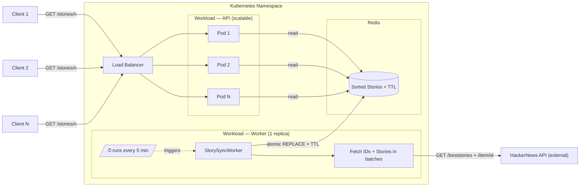

# HackerNews Gateway API

ASP.NET Core REST API that returns the best N stories from the [Hacker News API](https://github.com/HackerNews/API), sorted by score descending.

## How to Run

**Requirements:** .NET 10 SDK

```bash
cd HackerNewsGatewayApi
dotnet run
```

The API will be available at `https://localhost:7166` or `http://localhost:5294`.

## Endpoint

```
GET /stories/{n}
```

Returns the top `n` stories sorted by score descending. Maximum `n` is 100 (configurable).

**Example:**
```bash
curl https://localhost:7166/stories/5
```

**Response:**
```json
[
  {
    "title": "A uBlock Origin update was rejected from the Chrome Web Store",
    "uri": "https://github.com/uBlockOrigin/uBlock-issues/issues/745",
    "postedBy": "ismaildonmez",
    "time": "2019-10-12T13:43:01+00:00",
    "score": 1716,
    "commentCount": 572
  }
]
```

**Status codes:**
| Code | Reason |
|---|---|
| 200 | Success |
| 400 | `n` is zero, negative, or exceeds the configured maximum |
| 503 | Cache still warming up on cold start (retry after 10s) |

## Current Architecture

```
StorySyncWorker (BackgroundService — co-hosted with API)
  └── every 5 min: fetches 500 IDs → chunks of 20 → Task.WhenAll per chunk
  └── StoryRanking.FromResults() → sorts by score descending
  └── writes to StoryCache (in-memory, ImmutableList)

StoryCache (Singleton)
  └── lock-free reads via Interlocked.Exchange + Volatile.Read

StoriesController
  └── GET /stories/{n} → StoryCache.Take(n) — zero I/O on request path
```

## Configuration

`appsettings.json`:
```jsonc
{
  "HackerNews": {
    "BaseUrl": "https://hacker-news.firebaseio.com", // base URL of the Hacker News Firebase API
    "SyncIntervalMinutes": 5,                        // how often the background worker refreshes the story cache
    "TimeoutSeconds": 10,                            // per-request HTTP timeout when calling the HN API
    "SyncBatchSize": 20,                             // number of story IDs fetched in parallel per batch
    "MaxStories": 100                                // upper bound on n accepted by GET /stories/{n}
  }
}
```

---

## Ideal Production Architecture

The current implementation co-hosts the worker and the API in the same process for simplicity. In a production environment with real scalability requirements, these concerns should be fully separated. Below is the target architecture.



### Flow Explained

| Step | Component | What happens |
|---|---|---|
| 1 | Worker → HN API | Fetches best story IDs, then fetches each story detail in configurable batches |
| 2 | Worker → Redis | Atomically replaces the sorted story list with a TTL — stale detection built-in |
| Request | API Pod | Reads directly from Redis — no local cache needed given Redis latency is <1ms inside the cluster |
| Fallback | API Pod | If Redis is unavailable, returns 503 — no stale data served |

> **Optional enhancement:** if read latency ever becomes a concern (e.g. Redis outside the cluster), add a local `ImmutableList` cache per pod refreshed via Redis Pub/Sub invalidation — worker publishes an event after step 3, pods reload on signal instead of polling.

### What This Implementation Is Missing vs. the Ideal Flow

| Gap | Impact | Resolution |
|---|---|---|
| Worker co-hosted with API | Cannot scale API independently; worker restarts with every deploy | Separate Kubernetes Deployments |
| No shared store | Each API pod would have its own in-memory state | Redis as shared store |
| No TTL on stored data | API cannot detect if the worker has been silent for too long | Set TTL on Redis key; return `stale` header if expired |
| No Polly retry/circuit breaker | Transient HN API errors abort the entire sync batch | Polly with exponential backoff per item |

---

## Assumptions

- The best stories list (up to 500) is small enough to fit entirely in memory (~500KB).
- Scores change slowly enough that a 5-minute refresh window is acceptable.
- Stories with missing fields (deleted/dead items) are silently skipped.
- No authentication is required on the gateway endpoint.

## Trade-offs & Known Limitations

**In-process background worker**
The sync worker runs inside the same process as the API. See the _Ideal Production Architecture_ section above for the target design.

**No retry policy**
If the Hacker News API is temporarily unavailable during a batch, that batch is skipped and the worker logs the error. The last successful cache continues to be served.

**Single instance only**
The in-memory cache is not shared across multiple instances. Horizontal scaling requires migrating to Redis as described above.

## Enhancements Given More Time

- Redis as shared store with atomic replace + TTL
- Pub/Sub cache invalidation (worker → API pods) — if local in-memory cache is added per pod
- Kubernetes readiness probe wired to cache warm-up
- Polly retry + circuit breaker on `HackerNewsClient`
- Rate limiting on the gateway endpoint
- Structured logging with OpenTelemetry
